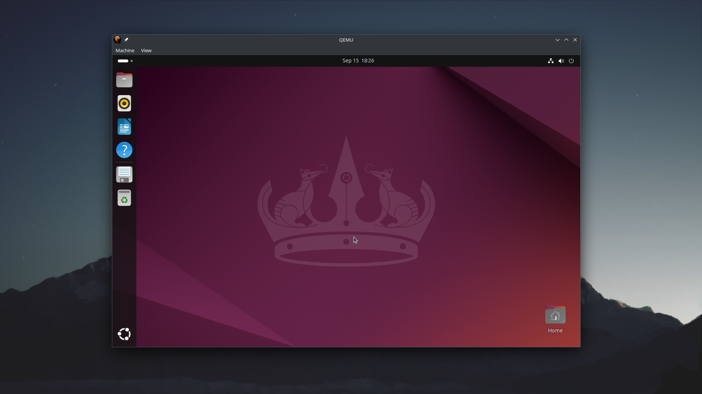

## Table Of Contents

- [Table Of Contents](#table-of-contents)
- [Preamble](#preamble)
- [1. Installing QEMU from source](#1-installing-qemu-from-source)
- [2. Running a virtual machine with QEMU](#2-running-a-virtual-machine-with-qemu)
  - [2.1 QEMU command breakdown](#21-qemu-command-breakdown)
  - [2.2 Launching the vm & installing the guest OS](#22-launching-the-vm--installing-the-guest-os)
- [3. Quality of life improvements](#3-quality-of-life-improvements)
  - [3.1 Expose vm services to outside with SLIRP](#31-expose-vm-services-to-outside-with-slirp)
  - [3.2 Enable QEMU monitor console](#32-enable-qemu-monitor-console)
  - [3.3 Enable remote desktop with VNC](#33-enable-remote-desktop-with-vnc)
  - [3.4 OpenGL acceleration with SDL](#34-opengl-acceleration-with-sdl)
  - [3.5 Audio pass-through with PipeWire or PulseAudio](#35-audio-pass-through-with-pipewire-or-pulseaudio)
- [What's Next](#whats-next)
- [TL;DR](#tldr)


## Preamble

When I decided to start virtualizing vms on Linux with KVM I found myself with 2 interesting options:
1. Using QEMU
2. Using `libvir` with `virt-manager`

Given how `libvirt` uses QEMU underneath (and how I'm not really a fan of its xml config) I decided to bet on QEMU.

It was a bit painful to get started, however: docs was very technical and sparse; many things I found on internet where
either already deprecated or not really explained and looked like magic.

It's been a couple of years now, and I'd like to think I can finally say I know what I'm doing (well, mostly).

So, ~~given how empty my blog is~~ I decided to compile this 'small' guide on how to get started with QEMU.

I'm going to briefly explain:
1. How to install the latest QEMU version on linux (a.k.a. building latest from source).
2. Run an Ubuntu 24 vm and make it performant thanks to para-virtualization magic.
3. Enable some really cool quality of life stuff which QEMU can do.

I'm running Debian 12 so you'll see `apt` commands.

I'm also going to assume you already know basic virtualization concepts (e.g hypervisor, para-virtualization, etc.)

Let's get started.

## 1. Installing QEMU from source

I'm going to use the [github official mirror](https://github.com/qemu/qemu) since everyone most likely knows github better.
There is no different from the official original repo though.

Each QEMU release is kept in its own branch; right now the latest is QEMU 9.1 in the `stable-9.1` branch, so I'm
going to be using that. The `--single-branch` and `--depth 1` are just for reducing the size of the cloned repo (it will
exclude all history and all other branches).

```bash
cd /opt
sudo git clone https://github.com/qemu/qemu.git --single-branch --depth 1 --branch stable-9.1
```

Now we prepare the repo for building the project:
```bash
sudo chown -R "$USER" qemu
cd qemu
git submodule update --init --recursive # get qemu dependencies; this may take a while
mkdir -p build && cd build
# ensure we have required libs and respective source files for deps
sudo apt-get update
sudo apt-get install -y build-essential libslirp-dev libusb-1.0-0-dev python3-sphinx \
  python3-sphinx-rtd-theme ninja-build libglib2.0-dev libpixman-1-dev libgtk-3-dev \
  libvirglrenderer-dev libsdl2-dev libpipewire-0.3-dev
```

> **Note**: If you have a keen eye, you'll have noticed some interesting libs are in the mix (e.g. `libvirglrenderer` and `libpipewire`).
> While these libraries are not mandatory for building QEMU, I'll show you some really neat thing you can do in the last
> section of this guide. So for know, let's keep going.

Now build and install the project:
```bash
../configure --prefix=/opt/qemu --target-list=x86_64-softmmu --enable-vnc --enable-avx2 --enable-virtfs \
  --enable-slirp --enable-libusb --enable-gtk --enable-virglrenderer --enable-opengl --enable-sdl --enable-pipewire
make -j$(nproc)
sudo make install
```

Now you should have your binaries under `/opt/qemu/bin/`:
```bash
$ /opt/qemu/bin/qemu-system-x86_64 --version
QEMU emulator version 9.1.0 (v9.1.0)
Copyright (c) 2003-2024 Fabrice Bellard and the QEMU Project developers
```

We can add it to PATH if we want:
```bash
export PATH="$PATH:/opt/qemu/bin"
```

## 2. Running a virtual machine with QEMU

So far so good, now with the actual useful part: go grab an iso of your favorite Linux distro and choose a folder for
storing your vm's data.

I'll be using Ubuntu 24 because ~~I feel like nuking snap out of existence, yet again~~ it is a very popular distro.

> **IMPORTANT**: for now, do not try to install Windows. We're going to use the para-virtual VirtIO controllers
> which are available by default for Linux but require manual driver installation for Windows.

First, we need to create the vm disk. We stick with 32G and default qcow2 config because it's simple and good enough:
```bash
/opt/qemu/bin/qemu-img create -f qcow2 demo-ubuntu24.qcow2 32G
```

Now, what I generally do is create a shell script and put the QEMU command there so it's very easy to use and remember.
```bash
touch run.sh && chmod +x run.sh
```

Add basic qemu command:
```bash
#!/bin/sh

exec /opt/qemu/bin/qemu-system-x86_64 \
    -enable-kvm \
    -cpu host \
    -smp 4 \
    -m 4096 \
    -netdev user,id=net0 -device virtio-net-pci,netdev=net0 \
    -device virtio-scsi-pci -drive file=demo-ubuntu24.qcow2,if=none,id=hd0,cache=writeback -device scsi-hd,drive=hd0 \
    -cdrom './ubuntu-24.04-desktop-amd64.iso' \
    -device usb-ehci,id=usb,bus=pci.0 \
    -device usb-tablet
```

Your folder should look like this right now:
```
.
├── demo-ubuntu24.qcow2
├── run.sh
└── ubuntu-24.04-desktop-amd64.iso
```

> **Note**: I always prefer specifying the full path of `qemu-system-x86_64` inside scripts to prevent potential
> conflict with older QEMU versions installed with distro package managers. Tbh, it's generally fine either way.

I said I'd be keeping it simple, yet I put a command quite intricate.

Technically, you can simplify it even more, but you'll lose soo much performance it will be unusable for pretty much
anything. I'd say this is a basic starting point for usable vms (as fast as Virtualbox/VMware or better).

Let's break it down.

### 2.1 QEMU command breakdown

---

```bash
exec /opt/qemu/bin/qemu-system-x86_64
```

`qemu-system-x86_64` is the QEMU binary responsible for running stuff for the x86 architecture (AMD64).

> You can build QEMU to target other architectures, say ARM, and then try to run an ARM vm with it while still
> on your x86 machine! While this may be pretty fun to try out (and also quite slow, since it's emulating an entirely
> different arch) I'd say it's not the focus of this guide.

---

```bash
    -enable-kvm \
```

Use hardware assisted virtualization (Intel VT-X or AMD-V) with KVM.

And yes, you can run a vm without KVM, but it will be painfully slow at everything.

---

```bash
    -cpu host \
```

QEMU is telling the vm to see our CPU 'exactly' as our host OS is seeing it. This means our vm
knows which CPU model is using and can use all its available features. In practice, the vm may run CPU intensive
operations much faster.

---

```bash
    -smp 4 \
    -m 4096 \
```

Use 4 CPU cores and 4Gb of RAM. Nothing too fancy here.

---

```bash
    -netdev user,id=net0 -device virtio-net-pci,netdev=net0 \
```

Here QEMU is attaching the para-virtualized network adapter `virtio-net-pci` to our vm.

> **Note**: If you need a fully-emulated network adapter for older Linux guests or Windows vms, you can use `e1000` instead.

---

```bash
    -device virtio-scsi-pci -drive file=demo-ubuntu24.qcow2,if=none,id=hd0,cache=writeback -device scsi-hd,drive=hd0 \
```

This line defines our vm storage and binds it to our previously created disk `demo-ubuntu24.qcow2`.

The storage controller `virtio-scsi-pci` is a modern and extremely fast para-virtualized interface which handles reads
and writes to disks. Just like for the VirtIO network adapter, modern Linux systems have VirtIO drivers already bundled.
If it were a Windows OS, you would need to manually install the [Windows VirtIO drivers](https://github.com/virtio-win/kvm-guest-drivers-windows)
before OS installation.

`cache=writeback` adds an extra layer of caching to our disk which should make it just a bit faster than without cache
(`cache=none`) and without too many compromises for our use case. Proxmox has
[really good docs about this topic](https://pve.proxmox.com/wiki/Performance_Tweaks#Disk_Cache) if you want to dive in.

> **Note**: The reason why I particularly obsess about disk performance is because my setup is running vms on throwaway
> spinning disks for costs reasons. If they were SSDs, I'd be using `cache=none` and more conservative options.
> VirtIO is still the go-to solution though.

---

```bash
    -cdrom './ubuntu-24.04-desktop-amd64.iso' \
```

We mount our iso as a cd. This way, the first time we launch our vm, QEMU will detect an empty disk and automatically
try to boot from disk. This is the same procedure you do for physical OSes installation. You can also manually change
boot order with the `-boot` flag.

---

```bash
    -device usb-ehci,id=usb,bus=pci.0 \
    -device usb-tablet
```

This is a bit of magic recommended by QEMU to make the vm treat your cursor as an actual mouse device. This fixes weird
mouse behaviours when entering/leaving the vm with your cursor.

It can be safely omitted when running vms in headless mode (e.g. `-display none`).

---

### 2.2 Launching the vm & installing the guest OS

```bash
./run.sh
```

A window should open, and you can start installing your distro.

> **Note**: **DO NOT** Ctrl+C your terminal. This will instantly poweroff your vm the hard way.

Once the distro has been installed, shutdown the vm and unmount the install iso.

```bash
    -cdrom '' \
```

And it's done! your `run.sh` should now look something like this:
```bash
#!/bin/sh

exec /opt/qemu/bin/qemu-system-x86_64 \
    -enable-kvm \
    -cpu host \
    -smp 4 \
    -m 4096 \
    -netdev user,id=net0 -device virtio-net-pci,netdev=net0 \
    -device virtio-scsi-pci -drive file=demo-ubuntu24.qcow2,if=none,id=hd0,cache=writeback -device scsi-hd,drive=hd0 \
    -cdrom '' \
    -device usb-ehci,id=usb,bus=pci.0 \
    -device usb-tablet
```



## 3. Quality of life improvements

QEMU has a metric ton of configurations and some really cool stuff.

I'm now going to show just a glimpse of some interesting things that can be done.

### 3.1 Expose vm services to outside with SLIRP

Your guest vm can access external resources on the web without problems, but chances are you may also want to access
a service running on the vm itself. With our current configuration, it can't be done because your guest is being NATted by
QEMU.

Here we have 2 choices:
1. Remove the NAT and use a bridge network adapter.
2. Manually configure QEMU to forward the interested ports from the vm to the host.

While the first option sounds best, it is also the most complicated one. Essentially, you'd have to edit your host network
settings and use [QEMU tap network backend](https://wiki.qemu.org/Documentation/Networking#Tap). This causes further problems
if you ever have the need to have more than 1 vm running at the same time.

We're left with option n.2, which despite sounding hard, is actually pretty simple.

> **Note**: for this to work, QEMU must be built with the SLIRP flag enabled and against libslirp. Again, if you have
> installed QEMU with the steps above, everything should just work fine.

We're now going to expose the SSH port 22 to the outside.

In your QEMU command, change the network config from this:
```bash
    -netdev user,id=net0 -device virtio-net-pci,netdev=net0 \
```
to this:
```bash
    -netdev user,id=net0,hostfwd=tcp::5555-:22 -device virtio-net-pci,netdev=net0 \
```

This reads: forward TCP traffic on guest port 22 to the host on the port 5555 and vice versa.

After you boot your guest, ensure an ssh server is running on port 22. In my case, Ubuntu 24 desktop does not have one
preinstalled (I'm not using the server version, so makes sense):
```bash
sudo apt-get update
sudo apt-get install -y openssh-server
```

From the host I should now be able to connect via ssh to the guest with user `user` and port 5555:
```bash
ssh user@localhost -p 5555
```

The SLIRP procedure is described in the official docs [here](https://wiki.qemu.org/Documentation/Networking#User_Networking_(SLIRP)).

> **Note**: The major limitation with this method is that you need to know which ports are going to be exposed before
> running the vm. You can kind of get around that by only exposing the ssh port and then create an ssh tunnel to expose all
> the others. I think I'm going to write a shorter post about this to keep things brief here.

The SLIRP method has more overhead compared to bridging your vm, but we are not running vms in production here. If doing
so is your end-goal, I recommend going with [Proxmox](https://www.proxmox.com) straight away which already comes with
vms bridging capabilities out of the box.

### 3.2 Enable QEMU monitor console

Right now, running a vm with the script will cause the console screen to remain unusable until the vm is shutdown. We can
use this opportunity to make it do something more useful: QEMU has a [monitor](https://qemu-project.gitlab.io/qemu/system/monitor.html)
console which can be used to view, edit and manage your vm config live!

It can be enabled and bound to the current terminal screen with the following:
```bash
    -monitor stdio \
```

This way, after launching the vm you'll get the following prompt:
```bash
$ ./run.sh
QEMU 9.1.0 monitor - type 'help' for more information
(qemu)
```

### 3.3 Enable remote desktop with VNC

[VNC](https://en.wikipedia.org/wiki/VNC) is a protocol which allows to connect to a virtual machines remotely in the
same way you can do with Remote Desktop for Windows OS.

To expose the VNC server with the default port 5900, add the following to your QEMU command:
```bash
    -vnc :0 \
```

Next, grab a VNC client such as [KRDC](https://apps.kde.org/krdc), [VNC Viewer](https://www.realvnc.com/en/connect/download/viewer/),
[TigerVNC](https://tigervnc.org/), or other.

To connect to your vm, use the connection url: `vnc://localhost:5900`

### 3.4 OpenGL acceleration with SDL

Right now, your vm window when the vm starts is rendered with your CPU. This is generally fine since it's a small window
and rendering the OS windows won't be too much of a burden on your CPU.

But, what if you want a fullscreen window and, say you have a 4K display? or what if you need to run a more intensive
graphical application in your guest? Chances are you want to use your GPU to make it bearable and much smoother. Here's
how to show a 1920x1080 OpenGL rendered window backed by SDL2:
```bash
    -display sdl,gl=on \
    -device virtio-vga-gl,xres=1920,yres=1080 \
```

Remember to right click the window and put it in fullscreen for the best experience :)

> **Note**: This can only be enabled if QEMU has been built with the correct flags and dependencies set. If you installed
> QEMU with the steps above I already made sure to include them. If QEMU has been installed with your OS package manager,
> certain features may or may not be available.

### 3.5 Audio pass-through with PipeWire or PulseAudio

> **Note**: Ensure your system is running PipeWire with: `pactl info | grep "Server Name"`. If it does not say PipeWire,
> you must use PulseAudio. Check the QEMU docs for such case.

Not going to lie, this is not really the best experience right now. Hopefully will get better with future versions
but here's the command anyway for your amusement:
```bash
    -audiodev pipewire,id=audio0,out.frequency=44100 \
    -device ich9-intel-hda \
    -device hda-micro,audiodev=audio0 \
```

With this, you can play a YouTube video in your vm and have your ears blasted with choppy audio!

## What's Next

If you've made it so far, then congratulations and thank you! This has been quite a bit of work.

Now that you have the basics down (and some more), I highly recommend giving the [official QEMU docs a read](https://qemu-project.gitlab.io/qemu/system/introduction.html).

If you intend to use QEMU/KVM more seriously and in production, all tricks applied here are valid, and you could very well
create your in-house hypervisor based on QEMU/KVM. It'll be a ton of work but surely very educative.

A more reasonable and less time-consuming alternative, is going with [Proxmox](https://www.proxmox.com/en/) which is an
hypervisor based on QEMU/KVM that's been around for quite a while now (and it's [open source](https://git.proxmox.com/)!).

They also have [a very good and comprehensive documentation](https://pve.proxmox.com/pve-docs/pve-admin-guide.html).

## TL;DR

For when you just need quick copy-and-paste QEMU configs.

This is my QEMU configuration for Linux server vms:
```bash
#!/bin/sh

exec /opt/qemu/bin/qemu-system-x86_64 \
    -enable-kvm \
    -cpu host \
    -smp 8 \
    -m 8192 \
    -display gtk \
    -netdev user,id=net0,hostfwd=tcp::2200-:22 -device virtio-net-pci,netdev=net0 \
    -device virtio-scsi-pci -drive file=<DISK_NAME>.qcow2,if=none,id=hd0,cache=writeback -device scsi-hd,drive=hd0 \
    -cdrom '' \
    -device usb-ehci,id=usb,bus=pci.0 \
    -device usb-tablet \
    -monitor stdio
```

And this for Linux desktop vms:
```bash
#!/bin/sh

exec /opt/qemu/bin/qemu-system-x86_64 \
    -enable-kvm \
    -cpu host \
    -smp 8 \
    -m 8192 \
    -display sdl,gl=on -vnc :0 \
    -device virtio-vga-gl,xres=1920,yres=1080 \
    -audiodev pipewire,id=audio0,out.frequency=44100 \
    -device ich9-intel-hda \
    -device hda-micro,audiodev=audio0 \
    -netdev user,id=net0 -device virtio-net-pci,netdev=net0 \
    -device virtio-scsi-pci -drive file=<DISK_NAME>.qcow2,if=none,id=hd0,cache=writeback -device scsi-hd,drive=hd0 \
    -cdrom '' \
    -device usb-ehci,id=usb,bus=pci.0 \
    -device usb-tablet \
    -monitor stdio
```
